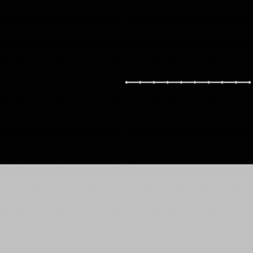
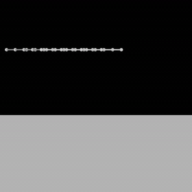
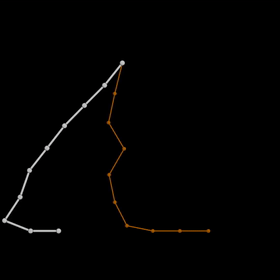
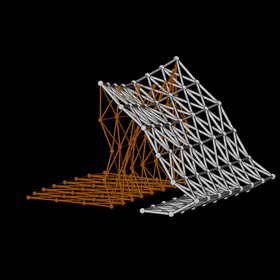
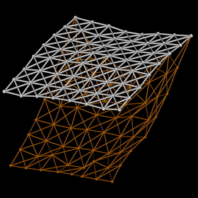

# DiffXPBD

Differentiable XPBD (Extended Position-Based Dynamics) for cloth/chain. Two implementations: **C++/Eigen** (forward + hand-written adjoint) and **JAX** (autodiff via `grad`). Same simulation, same config, comparable output.

## Examples of Forward Simulations

| cloth(10, 10) - Free Fall | Chain(10) - Collision | cloth(5, 5) - Collision |
| :-----------------------: | :-------------------: | :---------------------: |
|        |    |      |

## Fitting Examples

|  chain(10) - Collision  | cloth(8, 8)- Collision | cloth(8, 8) - Free Fall |
| :---------------------: | :---------------------: | :---------------------: |
|  |  |  |

## Contents

```
src/main.cpp     C++ sim + adjoint (gravity, ground collider, distance constraints, Jacobi 1-iter)
src/param.conf   parameters (sim_rate, gravity, object, compliance, ...)
jax_impl.py      same solver in JAX, automatic gradient w.r.t. compliance
compare.ipynb    numerical comparison C++ vs JAX
animation/       per-frame .obj output (target_*.obj, guess_*.obj) — loadable in animator.blend
external/eigen   header-only, vendored
CMakeLists.txt   C++ build
docs/            theory notes (PDF)
```

## Theory

[docs/InversePhysics.pdf](docs/InversePhysics.pdf) — notes covering the implicit BDF1 simulator, the adjoint method for gradients, Baraff-Witkin cloth, descent / primal-dual methods, and the XPBD adjoint derivation this repo implements.

## Build (C++)

Requires CMake ≥ 3.16 and a C++17 compiler (MSVC / clang / gcc).

```bash
cmake -S . -B build
cmake --build build --config Release
./build/bin/xpbd              # Linux/macOS
build\bin\Release\xpbd.exe    # Windows
```

## Run JAX

```bash
pip install jax numpy
python jax_impl.py
```

Prints target/guess final positions, loss, and `dL/dcompliance`.

## Config (`src/param.conf`)

One `key = value` per line; `#`, `;`, `//` start comments. Both impls read the same file (pass a path as the first CLI arg, relative to the project root, otherwise the standard path `src/param.conf` is used).

```
sim_rate          = 312                 # integration substeps per second
n_seconds         = 4                   # simulated duration in integer seconds
gravity           = (0.0, -9.81, 0.0)
fps               = 24                  # .obj export rate
target_compliance = 0.0005              # compliance of the ground-truth "target" sim
compliance        = 0.0001              # compliance of the "guess" sim
target_offset     = (0.0, 0.0, 0.0)     # initial position offset of the target object
offset            = (0.0, 0.0, 0.0)     # initial position offset of the guess object
obj               = cloth(10, 10)       # chain(N) | cloth(W, H)
colliders         = [ halfspace((0.0, -5.0, 0.0), (0.0, 1.0, 0.0)) ]
export_obj        = true                # write per-frame target_*.obj / guess_*.obj into animation/
experiment        = compliance_optimization(50)
optimizer         = momentum(1e-8, 0.8)
loss              = mse_frames_trajectory(24)
```

Field notes:

- **colliders** — a list `[ ... ]` of collision primitives. An empty list `[]` (or omitting the field) means no collisions. Each entry is `name(args)`:
  - `halfspace((ox, oy, oz), (nx, ny, nz))` — a plane through point `(ox, oy, oz)` with outward normal `(nx, ny, nz)`;
- **experiment** — what to run:
  - `forward_simulation` — just runs the target and guess forward sims (writes the `.obj` frames if exported enabled).
  - `compliance_gradient` — `dL/dcompliance`
  - `x0_gradient` — `dL/d(initial positions)`.
  - `single_step_jacobian(step)` — the per-step Jacobian `dx⁺/dx⁻` at update `step`.
  - `compliance_optimization(iters)` — gradient-descent fit of compliance to the target for `iters` steps (uses `optimizer`).
- **optimizer** — descent rule, only for optimization experiments:
  - `GD(lr)`
  - `momentum(lr, beta)`
  - `ADAM(lr, beta1, beta2, epsilon)`
- **loss** — trajectory-matching error:
  - `mse_final_position` (only final frame)
  - `mse_full_trajectory` (every single step)
  - `mse_frames_trajectory(fps)` (frames sampled at `fps`)

## Visualize in Blender

The per-frame `.obj` files written to `animation/` (when `export_obj = true`) are viewed via `animation/animator.blend`.

**Requirements**

- **Blender 4.3** — the file is saved in 4.3 (EEVEE Next).
- **[Stop-motion-OBJ](https://github.com/neverhood311/Stop-motion-OBJ)** add-on, installed **and enabled**. The import script calls its `loadSequenceFromMeshFiles` (Python module `mesh_sequence_controller`).

**Steps**

1. Run a sim with `export_obj = true` so `animation/` holds the frames (`guess_*.obj`, `target_*.obj`).
2. Open `animation/animator.blend`.
3. The file embeds a script that registers a **DiffXPBD** panel in the 3D Viewport sidebar (press `N`).
4. In the **DiffXPBD** panel click **Import sequences** (operator `diffxpbd.import_sequences`): it loads the `guess_*` and `target_*` `.obj` sequences from `animation/` as Stop-motion-OBJ mesh sequences. Scrub the timeline to play.
